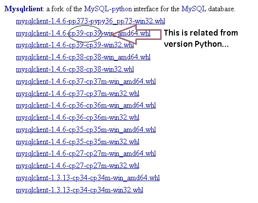
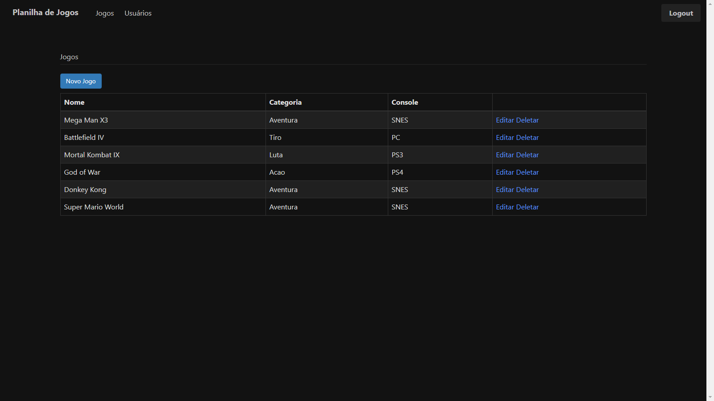
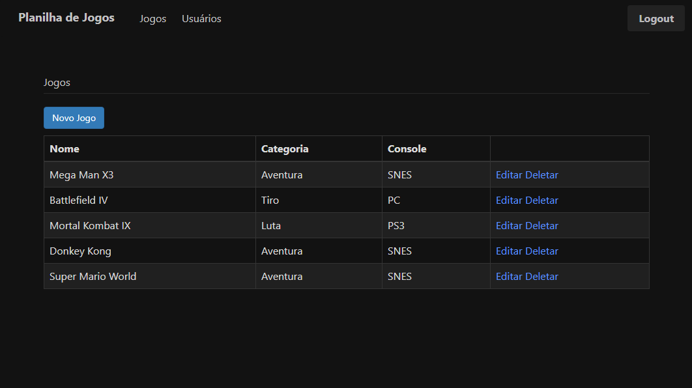

<h1>
    Web Developer Creating CRUD
</h1>

Simple project where created one CRUD using **Python** with framework **Flask**.

_**Tools used**_<h3>:hammer_and_wrench:</h3>

Python, Flask, JavaScript and Jquery, JS and JQ were used for render images.

<h1> How Running Project your System :rocket:</h1> 

First shall create environment python using command _**python -m venv .venv**_

You need install Mysql Server.

You need install Mysqlclient for [Python Extension Packages for Windows](https://www.lfd.uci.edu/~gohlke/pythonlibs/#mysqlclient)

 

Make install - to install packages from flask needed to run the application :construction_worker:

run prepara_banco.py - create db

run jogoteca.py - finish!!! :rocket: now your system is runing

template list from games :video_game: :joystick:

template how add game in games list :bookmark_tabs:

