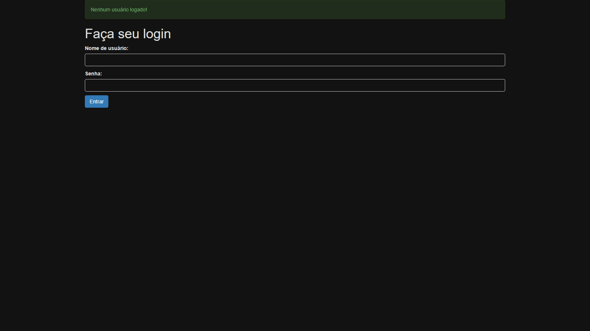
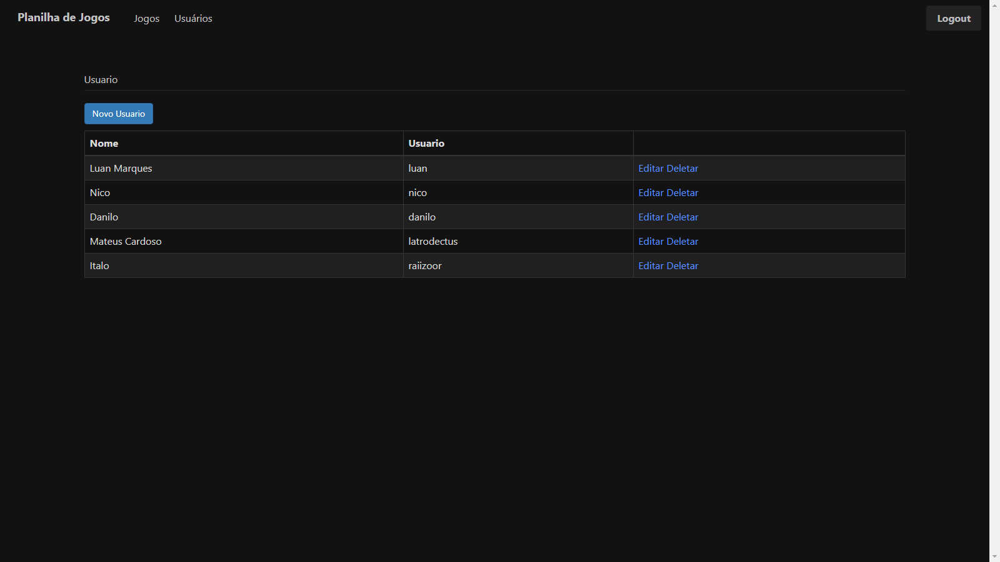

<h1>**Web Developer Creating CRUD** :construction_worker:</h1>

Simple project where created CRUD using **Python** with framework **Flask**.

_**Tools used**_ :hammer_and_wrench:

Python, Flask, JavaScript and Jquery, JS and JQ were used for render images.

<h1> **How Running Project your System** :rocket:</h1> 

First shall create environment python using command _**python -m venv .venv**_

You need install Mysql Server and Mysqlclient for [Python Extension Packages for Windows](https://www.lfd.uci.edu/~gohlke/pythonlibs/#mysqlclient) <- Link for download.

 

Next you shall to give command in your enmviroment make install, to install packages from flask needed to run the application :construction_worker:

Run prepara_banco.py - will create db

Run jogoteca.py - finish!!! :rocket: Now your system is runing

Screen the Login, list from Games and list from Users.

<h1>**Aplication**</h1>

Login:  :woman_technologist:

List Games: :bookmark_tabs: :video_game: 

List Users: :bookmark_tabs: :mage:

How add game in games list: :bookmark_tabs: :man_technologist:

